# 事件 Event

<tldr>
基础的事件类型定义与介绍。
</tldr>

<note>

文档介绍的内容是经过**简化**、且非 **“实时”** 的。
如果你希望阅读更详细、更贴合版本真实情况的描述,
请前往参阅 [API文档引导站](https://docs.simbot.forte.love)
中相关内容的 `KDoc`。

</note>

## 基本事件类型

事件类型中, 比较基础、接近根部的类型。

<deflist>
<def title="Event" id="d-event">

事件。是所有事件类型的老父亲。

> 所有其他事件都直接或间接继承 `Event`,
> 在后续的类型定义中将不再赘述。

属性：

<deflist type="medium">
<def title="id">

`ID` 类型, 事件的ID。

根据不同的场景, 它可能是真实的, 也可能是随机的。

</def>
<def title="time">

`Timestamp` 类型, 事件发生的时间或此事件被接收到的时间。

</def>
</deflist>

</def>
<def title="ComponentEvent" id="d-component-event">

代表一个含有
<tooltip term="组件标识"><code>Component</code></tooltip>
信息的事件。

属性：

<deflist type="medium">
<def title="component">

`Component` 类型, 事件所属组件的组件标识。

</def>
</deflist>

</def>
<def title="BotEvent" id="d-bot-event">

继承 [`ComponentEvent`](#d-component-event),
代表一个含有 `Bot` 的事件。

属性：

<deflist type="medium">
<def title="bot">

`Bot` 类型, 事件所属或源自的 `Bot`。

</def>
</deflist>

</def>
<def title="ContentEvent" id="d-content-event">

存在一个 **主要事件中心 (`content`)** 的事件类型。

属性：

<deflist type="medium">
<def title="content">

`Any?` 类型, 也就是可能为任何类型, 代表这个事件的**主要事件中心**。

> `content` 的具体类型主要由其他具体实现类来覆盖定义。

</def>
</deflist>

</def>
<def title="SourceEvent" id="d-source-event">

存在一个 **源头 (`source`)** 的事件类型。
通常与 [`ContentEvent`](#d-content-event) 配合实现。

属性：

<deflist type="medium">
<def title="source">

`Any?` 类型, 也就是可能为任何类型, 代表这个事件的 **“源头”** 。

> `source` 的具体类型主要由其他具体实现类来覆盖定义。

</def>
</deflist>

</def>
<def title="ChangeEvent" id="d-change-event">

继承 [`ContentEvent`](#d-content-event),
发生了某种变化的事件。

属性：

<deflist type="medium">
<def title="content">

`Any?` 类型, 也就是可能为任何类型, 代表这个事件的 **发生了变化的主体。** 。

> `content` 继承自 [`ContentEvent`](#d-content-event)。

</def>
</deflist>
</def>
</deflist>

## 行为对象 Actor 相关事件

一些与
<tooltip term="行为对象">行为对象</tooltip>
相关、并将其视为**事件中心**的事件类型。

<deflist>
<def title="ActorEvent" id="d-actor-event">

所有**行为对象事件**的统一父类, 继承 [BotEvent](#d-bot-event)、[ContentEvent](#d-content-event)。

> **本节内**所有其他事件都继承 `ActorEvent`, 在后续的类型定义中将不再赘述。

属性：

<deflist type="medium">
<def title="content">

`Actor` 类型, 被作为事件中心的
<tooltip term="行为对象">行为对象</tooltip>。

> `content` 继承自 [`ContentEvent`](#d-content-event)。
>
> 本节内后续出现的此属性将不再赘述此说明。

</def>
</deflist>

</def>
<def title="ContactEvent">

以
<tooltip term="联系人">联系人</tooltip>
为中心的事件。

属性：

<deflist type="medium">
<def title="content">

`Contact` 类型, 被作为事件中心的
<tooltip term="联系人">联系人</tooltip>。

</def>
</deflist>

</def>
<def title="OrganizationEvent" id="d-organization-event">

以
<tooltip term="组织">组织</tooltip>
为中心的事件。

属性：

<deflist type="medium">
<def title="content">

`Organization` 类型, 被作为事件中心的
<tooltip term="组织">组织</tooltip>。

</def>
</deflist>

</def>
<def title="ChatRoomEvent">

以
<tooltip term="聊天室">聊天室</tooltip>
为中心的事件。

属性：

<deflist type="medium">
<def title="content">

`ChatRoom` 类型, 被作为事件中心的
<tooltip term="聊天室">聊天室</tooltip>。

</def>
</deflist>

</def>
<def title="ChatGroupEvent">

以
<tooltip term="聊天群">聊天群</tooltip>
为中心的事件。

属性：

<deflist type="medium">
<def title="content">

`ChatGroup` 类型, 被作为事件中心的
<tooltip term="聊天群">聊天群</tooltip>。

</def>
</deflist>

</def>
<def title="GuildEvent">

以
<tooltip term="频道服务器">频道服务器</tooltip>
为中心的事件。

属性：

<deflist type="medium">
<def title="content">

`Guild` 类型, 被作为事件中心的
<tooltip term="频道服务器">频道服务器</tooltip>。

</def>
</deflist>

</def>
<def title="ChannelEvent">

以
<tooltip term="频道">频道</tooltip>
为中心的事件。

属性：

<deflist type="medium">
<def title="source">

`Guild` 类型, 此事件中心的频道所属的
<tooltip term="频道服务器">频道服务器</tooltip>。

</def>
<def title="content">

`Channel` 类型, 被作为事件中心的
<tooltip term="频道">频道</tooltip>。

</def>
</deflist>

</def>
<def title="ChatChannelEvent">

以
<tooltip term="聊天频道">聊天频道</tooltip>
为中心的事件。

属性：

<deflist type="medium">
<def title="source">

`Guild` 类型, 此事件中心的频道所属的
<tooltip term="频道服务器">频道服务器</tooltip>。

</def>
<def title="content">

`ChatChannel` 类型, 被作为事件中心的
<tooltip term="聊天频道">聊天频道</tooltip>。

</def>
</deflist>

</def>
<def title="OrganizationSourceEvent">

以
<tooltip term="组织">组织</tooltip>
作为源头、但并非事件主要主体的事件类型。

> 此类型不实现 [ActorEvent](#d-actor-event),
> 但会与下述部分 [MemberEvent](#d-member-event) 相关类型的事件相互配合。

属性：

<deflist type="medium">
<def title="source">

`Organization` 类型, 事件中心的所属源头
<tooltip term="组织">组织</tooltip>。

</def>
</deflist>

</def>
<def title="MemberEvent" id="d-member-event">

以
<tooltip term="组织成员">组织成员</tooltip>
为中心的事件。

属性：

<deflist type="medium">
<def title="source">

`Organization` 类型, 此事件中心的组织成员所属的源头
<tooltip term="组织">组织</tooltip>。

</def>
<def title="content">

`Member` 类型, 被作为事件中心的
<tooltip term="组织成员">组织成员</tooltip>。

</def>
</deflist>

</def>
<def title="ChatGroupMemberEvent" id="d-group-member-event">

以一个
<tooltip term="聊天群">聊天群</tooltip>
中的
<tooltip term="组织成员">组织成员</tooltip>
为中心的事件。

属性：

<deflist type="medium">
<def title="source">

`ChatGroup` 类型, 此事件中心的组织成员所属的源头
<tooltip term="聊天群">聊天群</tooltip>。

</def>
<def title="content">

`Member` 类型, 被作为事件中心的
<tooltip term="组织成员">组织成员</tooltip>。

</def>
</deflist>

</def>
<def title="GuildMemberEvent" id="d-guild-member-event">

以一个
<tooltip term="频道">频道</tooltip>
中的
<tooltip term="组织成员">组织成员</tooltip>
为中心的事件。

属性：

<deflist type="medium">
<def title="source">

`Guild` 类型, 此事件中心的组织成员所属的源头
<tooltip term="频道">频道</tooltip>。

</def>
<def title="content">

`Member` 类型, 被作为事件中心的
<tooltip term="组织成员">组织成员</tooltip>。

</def>
</deflist>
</def>
</deflist>

## 请求相关事件

一些与**申请、请求**或相似概念相关的事件类型。

<deflist>
<def title="RequestEvent">

`Bot` 收到的某种与请求/申请有关的事件。继承 [BotEvent](#d-bot-event)。

> 本节内所有事件均继承 `RequestEvent`, 下文将不再赘述。

<deflist type="medium">
<def title="message">

`String?` 类型, 伴随请求的附加消息。可能为 `null`。

</def>
<def title="type">

`RequestEvent.Type` 枚举类型, 此申请的主动或被动类型。

元素：

- `PROACTIVE`
- `PASSIVE`

</def>
<def title="reject()">拒绝此请求。</def>
<def title="accept()">接受此请求。</def>
</deflist>

</def>
<def title="OrganizationRequestEvent">

`Bot` 收到的某种与
<tooltip term="组织">组织</tooltip>
相关的请求/申请有关的事件。

继承 [OrganizationEvent](#d-organization-event)。

</def>
<def title="OrganizationJoinRequestEvent">

某个用户想要加入目标
<tooltip term="组织">组织</tooltip>
的请求事件。

<deflist type="medium">
<def title="requesterId">

`ID` 类型, 申请人的 ID。

</def>
<def title="requester">

`User?` 类型, 尝试获取申请者的一些基础信息。
如果无法获取则可能为 `null`。

</def>
</deflist>

</def>
<def title="ChatGroupJoinRequestEvent">

某用户申请加入
<tooltip term="聊天群">聊天群</tooltip>
的事件。

<deflist type="medium">
<def title="content">

`ChatGroup` 类型, 被申请的
<tooltip term="聊天群">聊天群</tooltip>。

</def>
</deflist>

</def>
<def title="GuildJoinRequestEvent">

某用户申请加入
<tooltip term="频道">频道</tooltip>
的事件。

<deflist type="medium">
<def title="content">

`Guild` 类型, 被申请的
<tooltip term="频道">频道</tooltip>。

</def>
</deflist>

</def>
</deflist>

## 成员变动事件

一些与
<tooltip term="组织成员">组织成员</tooltip>
发生了**变化、变动**或相似概念相关的事件类型。

<deflist>
<def title="MemberChangeEvent">

当
<tooltip term="组织成员">组织成员</tooltip>
发生了某种变化时的事件。

> 本节内的事件均继承 `MemberChangeEvent`, 下文将不再赘述。

<deflist type="medium">
<def title="content">

`Member` 类型, 发生了变化的
<tooltip term="组织成员">组织成员</tooltip>。

</def>
</deflist>

</def>
<def title="GuildMemberChangeEvent">

当
<tooltip term="频道">频道</tooltip>
的
<tooltip term="组织成员">组织成员</tooltip>
发生了某种变化时的事件。

继承 [GuildMemberEvent](#d-guild-member-event)。

<deflist type="medium">
<def title="source">

`Guild` 类型, 发生变化所在的
<tooltip term="频道">频道</tooltip>。

</def>
<def title="content">

`Member` 类型, 发生了变化的
<tooltip term="组织成员">组织成员</tooltip>。

</def>
</deflist>

</def>
<def title="GroupMemberChangeEvent">

当
<tooltip term="聊天群">聊天群</tooltip>
的
<tooltip term="组织成员">组织成员</tooltip>
发生了某种变化时的事件。

继承 [GroupMemberEvent](#d-group-member-event)。

<deflist type="medium">
<def title="source">

`ChatGroup` 类型, 发生变化所在的
<tooltip term="聊天群">聊天群</tooltip>。

</def>
<def title="content">

`Member` 类型, 发生了变化的
<tooltip term="组织成员">组织成员</tooltip>。

</def>
</deflist>

</def>
</deflist>

## 组织变动事件

一些与
<tooltip term="组织">组织</tooltip>
发生了**变化、变动**或相似概念相关的事件类型。

<deflist>
<def title="OrganizationChangeEvent">

某
<tooltip term="组织">组织</tooltip>
产生了某种变化的事件。

继承 [ChangeEvent](#d-change-event) , [OrganizationEvent](#d-organization-event)。

> 本节内所有事件均继承 `OrganizationChangeEvent`, 下文将不再赘述。

<deflist type="medium">
<def title="content">

`Organization` 类型, 发生了变化的
<tooltip term="组织">组织</tooltip>。

</def>
</deflist>

</def>
<def title="MemberIncreaseOrDecreaseEvent">
某组织成员增加或减少的事件。

<deflist type="medium">
<def title="content">

`Organization` 类型, 增加或减少成员的
<tooltip term="组织">组织</tooltip>。

返回类型会根据实现类的场景而变化。

</def>
<def title="member">

`Member?` 类型, 增加或减少的
<tooltip term="组织成员">组织成员</tooltip>。
如不支持获取, 则可能得到 null 。

</def>
</deflist>

</def>
<def title="MemberIncreaseEvent">
某组织成员增加事件。继承 <code>MemberIncreaseOrDecreaseEvent</code>。
</def>
<def title="MemberDecreaseEvent">
某组织成员减少事件。继承 <code>MemberIncreaseOrDecreaseEvent</code>。
</def>
<def title="ChatGroupMemberIncreaseOrDecreaseEvent">
某 
<tooltip term="聊天群">聊天群</tooltip>
成员变动事件。
</def>
<def title="ChatGroupMemberIncreaseEvent">
某 
<tooltip term="聊天群">聊天群</tooltip>
成员增加事件。继承 <code>ChatGroupMemberIncreaseOrDecreaseEvent</code>。
</def>
<def title="ChatGroupMemberDecreaseEvent">
某 
<tooltip term="聊天群">聊天群</tooltip>
成员减少事件。继承 <code>ChatGroupMemberIncreaseOrDecreaseEvent</code>。
</def>
<def title="GuildMemberIncreaseOrDecreaseEvent">
某 
<tooltip term="频道">频道</tooltip>
成员变动事件。
</def>
<def title="GuildMemberIncreaseEvent">
某 
<tooltip term="频道">频道</tooltip>
成员增加事件。继承 <code>GuildMemberIncreaseOrDecreaseEvent</code>。
</def>
<def title="GuildMemberDecreaseEvent">
某 
<tooltip term="频道">频道</tooltip>
成员减少事件。继承 <code>GuildMemberIncreaseOrDecreaseEvent</code>。
</def>
</deflist>

## 消息事件

一些与**Bot收到消息**相关的事件类型。

<deflist>
<def title="MessageEvent" id="d-message-event">

一个 `Bot` 收到消息的事件。继承 [BotEvent](#d-bot-event)、`ReplySupport`。

> 本节内所有事件均继承 `MessageEvent`, 下文将不再赘述。

<deflist type="medium">
<def title="authorId">

`ID` 类型, 这个消息的发送人ID。

</def>
<def title="messageContent">

`MessageContent` 类型, 事件中收到的消息内容。

</def>
<def title="reply(...)">

基于此事件收到的消息进行回复。
来自 `ReplySupport` 接口。

</def>
</deflist>
</def>
<def title="ChatRoomMessageEvent">
一个 <code>Bot</code> 从 
<tooltip term="聊天室">聊天室</tooltip>
处收到消息的事件。
</def>
<def title="ChatGroupMessageEvent">
一个 <code>Bot</code> 从 
<tooltip term="聊天群">聊天群</tooltip>
处收到消息的事件。
</def>
<def title="ChatChannelMessageEvent">
一个 <code>Bot</code> 从 
<tooltip term="聊天频道">聊天频道</tooltip>
处收到消息的事件。
</def>
<def title="MemberMessageEvent">
一个 <code>Bot</code> 从 
<tooltip term="组织成员">组织成员</tooltip>
处收到消息的事件。
</def>
<def title="ChatGroupMemberMessageEvent">
一个 <code>Bot</code> 从 
<tooltip term="聊天群">聊天群</tooltip>
中的
<tooltip term="组织成员">组织成员</tooltip>
处收到消息的事件。
</def>
<def title="GuildMemberMessageEvent">
一个 <code>Bot</code> 从 
<tooltip term="频道">频道</tooltip>
中的
<tooltip term="组织成员">组织成员</tooltip>
处收到消息的事件。
</def>
<def title="ContactMessageEvent">
一个 <code>Bot</code> 从 
<tooltip term="联系人">联系人</tooltip>
处收到消息的事件。
</def>
</deflist>

## 内部事件

一些仅在内部流转、与外界无关的事件，通常用于一些内部的状态通知或功能拦截。

<warning>

所有的内部事件对于组件来讲都仅仅是一个可选的建议。
这些事件是否被实现取决于组件的实现情况。

组件在实现时可能会提供更进一步的事件类型或额外的扩展类型。

</warning>

### InternalEvent

<deflist>
<def title="InternalEvent" id="InternalEvent">

一些仅在内部流转、与外界无关的事件，通常用于一些内部的状态通知或功能拦截。

<deflist type="medium">
<def title="InternalNotificationEvent" id="InternalNotificationEvent">
一个内部通知事件。 通知性质的内部事件通常仅用作“通知”，即它不会对某些行为造成影响。
</def>
<def title="InternalInterceptionEvent" id="InternalInterceptionEvent">
一个内部拦截事件。

拦截性质的内部事件通常用作“拦截”，即它会对某些行为进行拦截，并有可能会产生影响，
例如改变原本行为的参数、或者通过抛出异常直接阻止某些行为的发生。
</def>
</deflist>
</def>
</deflist>

### BotStageEvent

<deflist>
<def title="BotStageEvent" id="BotStageEvent">

与 Bot 相关的阶段性事件。 例如bot被注册了、bot被启动了。

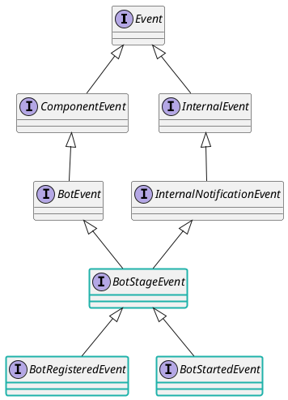

继承 [InternalEvent](#InternalEvent), [BotEvent](#d-bot-event)。

<deflist type="medium">
<def title="BotRegisteredEvent" id="BotRegisteredEvent">

当一个 Bot 已经在某个 `BotManager` 中被注册后的事件。

</def>
<def title="BotStartedEvent" id="BotStartedEvent">
当一个 Bot **首次** 启动成功后的事件。
</def>
</deflist>

</def>
</deflist>

### InternalMessageInteractionEvent 内部消息行为事件

<deflist>
<def title="InternalMessageInteractionEvent" id="InternalMessageInteractionEvent">

在内部一个跟 `Message` 的交互有关的事件。

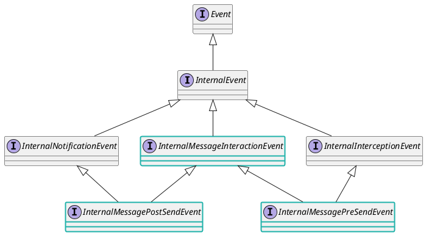

继承 [InternalEvent](#InternalEvent) 。

<deflist type="medium">
<def title="InternalMessagePreSendEvent" id="InternalMessagePreSendEvent">
针对消息交互时的内部拦截事件，可以对其中的参数进行修改。
</def>
<def title="InternalMessagePostSendEvent" id="InternalMessagePostSendEvent">

针对消息发送 (例如 `SendSupport.send` 或 `ReplySupport.reply`) 成功后的内部通知事件。
会在相关API执行成功后带着它的相关结果进行异步通知

</def>
</deflist>
</def>
</deflist>

#### SendSupportInteractionEvent SendSupport 行为事件

<deflist>
<def title="SendSupportInteractionEvent" id="SendSupportInteractionEvent">

针对 `SendSupport` 的内部交互事件，包括送信前的拦截与送信成功后的通知。

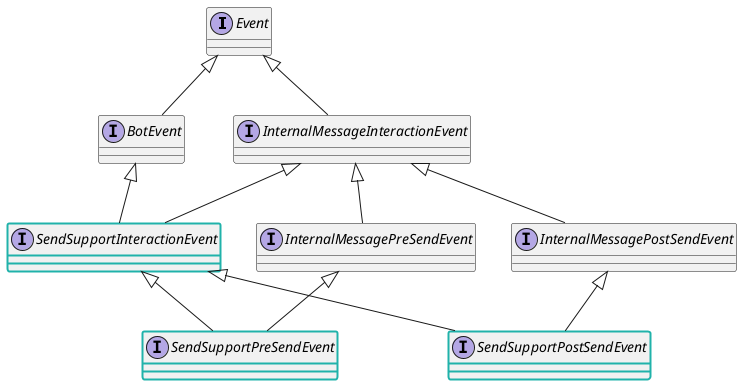

<deflist>
<def title="SendSupportPreSendEvent" id="SendSupportPreSendEvent">

针对 `SendSupport.send` 的内部拦截事件。可以对其中的参数进行修改。

</def>
<def title="SendSupportPostSendEvent" id="SendSupportPostSendEvent">

针对 `SendSupport.send` 的内部通知事件。会在 `SendSupport.send` 执行成功后带着它的相关结果进行异步通知。

</def>
</deflist>
</def>
<def title="ContactInteractionEvent" id="ContactInteractionEvent">

针对 `Contact.send` 的内部交互事件。

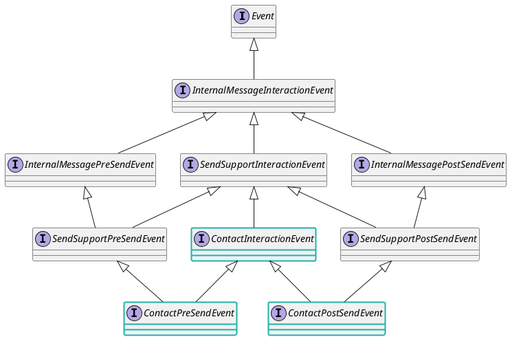

<deflist type="medium">
<def title="ContactPreSendEvent" id="ContactPreSendEvent">

针对 `Contact.send` 的内部交互事件, 在 `Contact.send` 执行前拦截。

</def>
<def title="ContactPostSendEvent" id="ContactPostSendEvent">

针对 `Contact.send` 的内部交互事件, 在 `Contact.send` 执行后通知。

</def>
</deflist>

</def>

<def title="MemberInteractionEvent" id="MemberInteractionEvent">

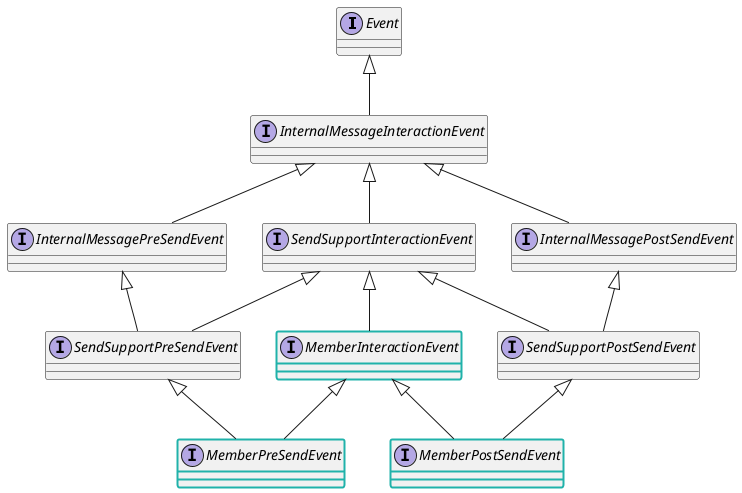

<deflist type="medium">
<def title="MemberPreSendEvent" id="MemberPreSendEvent">

针对 `Member.send` 的内部交互事件, 在 `Member.send` 执行前拦截。

</def>
<def title="MemberPostSendEvent" id="MemberPostSendEvent">

针对 `Member.send` 的内部交互事件, 在 `Member.send` 执行后通知。

</def>
</deflist>

</def>

<def title="ChatRoomInteractionEvent" id="ChatRoomInteractionEvent">

针对 `ChatRoom` 的内部交互事件。

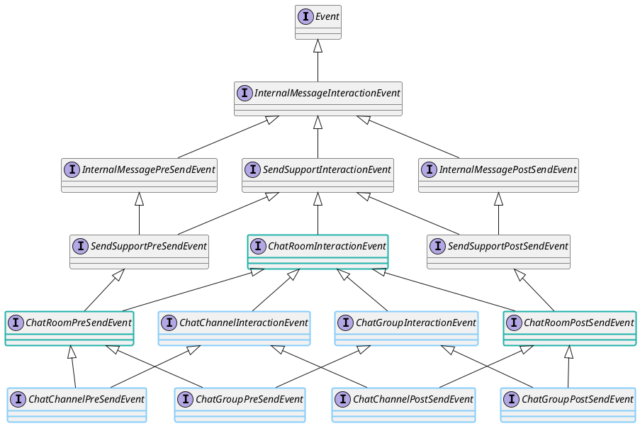

<deflist type="medium">
<def title="ChatRoomPreSendEvent" id="ChatRoomPreSendEvent">

针对 `ChatRoom.send` 的内部交互事件, 在 `ChatRoom.send` 执行前拦截。

</def>
<def title="ChatRoomPostSendEvent" id="ChatRoomPostSendEvent">

针对 `ChatRoom.send` 的内部交互事件, 在 `ChatRoom.send` 执行后通知。

</def>
<def title="ChatGroupInteractionEvent" id="ChatGroupInteractionEvent">

针对 `ChatGroup` 的内部交互事件

</def>
<def title="ChatGroupPreSendEvent" id="ChatGroupPreSendEvent">

针对 `ChatGroup.send` 的内部交互事件, 在 `ChatGroup.send` 执行前拦截。

</def>
<def title="ChatGroupPostSendEvent" id="ChatGroupPostSendEvent">

针对 `ChatGroup.send` 的内部交互事件, 在 `ChatGroup.send` 执行后通知。

</def>
<def title="ChatChannelInteractionEvent" id="ChatChannelInteractionEvent">

针对 `ChatChannel` 的内部交互事件

<def title="ChatChannelPreSendEvent" id="ChatChannelPreSendEvent">

针对 `ChatChannel.send` 的内部交互事件, 在 `ChatChannel.send` 执行前拦截。

</def>
<def title="ChatChannelPostSendEvent" id="ChatChannelPostSendEvent">

针对 `ChatChannel.send` 的内部交互事件, 在 `ChatChannel.send` 执行后通知。

</def>
</def>
</deflist>
</def>

</deflist>

#### ReplySupportInteractionEvent ReplySupport 行为事件

<deflist>
<def title="ReplySupportInteractionEvent" id="ReplySupportInteractionEvent">

针对 `ReplySupport` 的内部交互事件，包括送信前的拦截与送信成功后的通知。

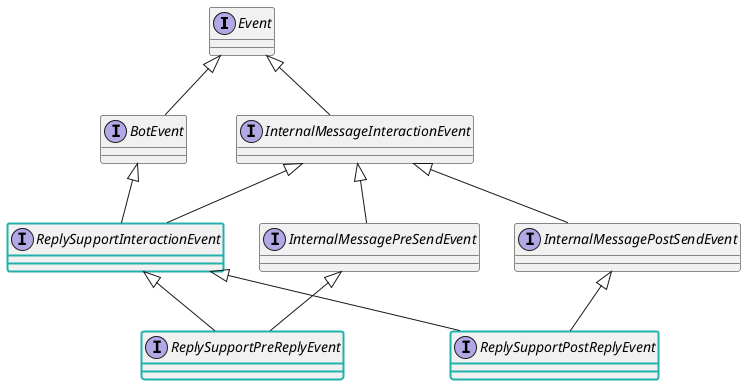

<deflist type="medium">
<def title="ReplySupportPreReplyEvent" id="ReplySupportPreReplyEvent">

针对 `ReplySupport.reply` 的内部拦截事件。 可以对其中的参数进行修改。

</def>
<def title="ReplySupportPostReplyEvent" id="ReplySupportPostReplyEvent">

针对 `ReplySupport.reply` 的内部通知事件。 会在 `ReplySupport.reply` 执行成功后带着它的相关结果进行异步通知。

</def>
</deflist>

</def>
<def title="MessageEventInteractionEvent" id="MessageEventInteractionEvent">

针对 `MessageEvent.reply` 的内部交互事件。

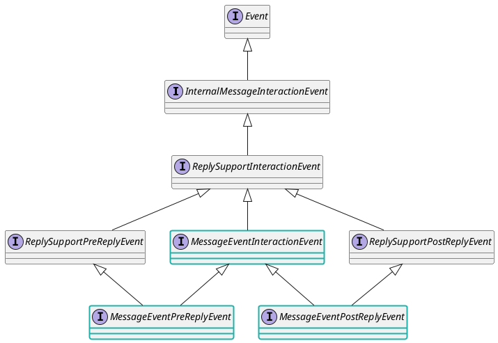

<deflist type="medium">
<def title="MessageEventPreReplyEvent" id="MessageEventPreReplyEvent">

针对 `MessageEvent.reply` 的内部拦截事件。 可以对其中的参数进行修改。

</def>
<def title="MessageEventPostReplyEvent" id="MessageEventPostReplyEvent">

针对 `MessageEvent.reply` 的内部通知事件。 会在 `MessageEvent.reply` 执行成功后带着它的相关结果进行异步通知。

</def>
</deflist>
</def>

<def title="ContactMessageEventInteractionEvent" id="ContactMessageEventInteractionEvent">

针对 `ContactMessageEvent.reply` 的内部交互事件。

<deflist type="medium">
<def title="ContactMessageEventPreReplyEvent" id="ContactMessageEventPreReplyEvent">

针对 `ContactMessageEvent.reply` 的拦截事件。

</def>
<def title="ContactMessageEventPostReplyEvent" id="ContactMessageEventPostReplyEvent">

针对 `ContactMessageEvent.reply` 的通知事件。

</def>
</deflist>

</def>
<def title="ChatRoomMessageEventInteractionEvent" id="ChatRoomMessageEventInteractionEvent">

针对 `ChatRoomMessageEvent.reply` 的内部交互事件。

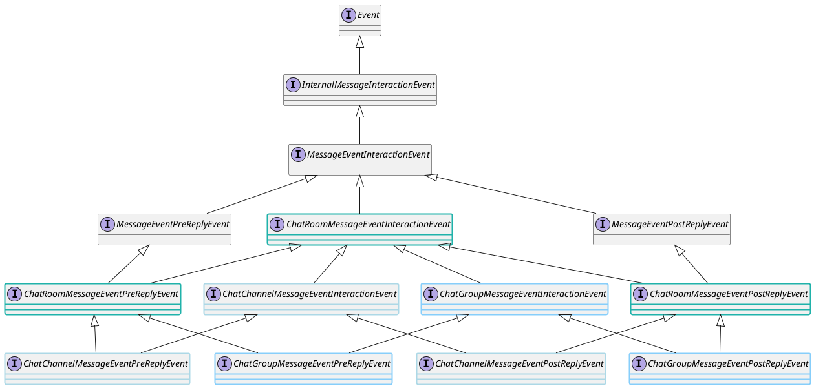

<deflist type="medium">
<def title="ChatRoomMessageEventPreReplyEvent" id="ChatRoomMessageEventPreReplyEvent">

针对 `ChatRoomMessageEvent.reply` 的拦截事件。

</def>
<def title="ChatRoomMessageEventPostReplyEvent" id="ChatRoomMessageEventPostReplyEvent">

针对 `ChatRoomMessageEvent.reply` 的通知事件。

</def>
</deflist>

</def>
<def title="MemberMessageEventInteractionEvent" id="MemberMessageEventInteractionEvent">

针对 `MemberMessageEvent.reply` 的内部交互事件。

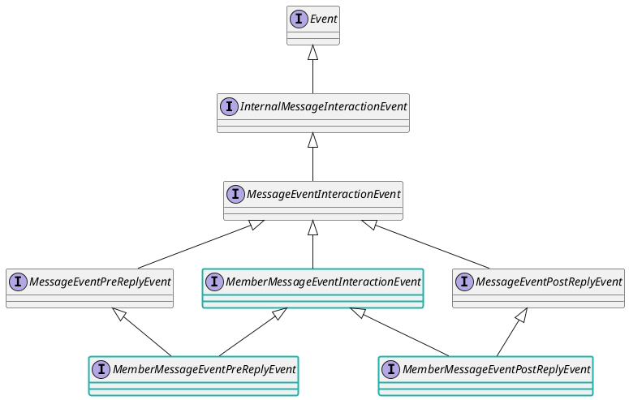

<deflist type="medium">
<def title="MemberMessageEventPreReplyEvent" id="MemberMessageEventPreReplyEvent">

针对 `MemberMessageEvent.reply` 的拦截事件。

</def>
<def title="MemberMessageEventPostReplyEvent" id="MemberMessageEventPostReplyEvent">

针对 `MemberMessageEvent.reply` 的通知事件。

</def>
</deflist>

</def>
<def title="GuildMemberMessageEventInteractionEvent" id="GuildMemberMessageEventInteractionEvent">

针对 `GuildMemberMessageEvent.reply` 的内部交互事件。

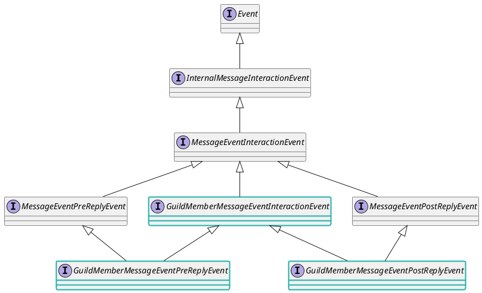

<deflist type="medium">
<def title="GuildMemberMessageEventPreReplyEvent" id="GuildMemberMessageEventPreReplyEvent">

针对 `GuildMemberMessageEvent.reply` 的拦截事件。

</def>
<def title="GuildMemberMessageEventPostReplyEvent" id="GuildMemberMessageEventPostReplyEvent">

针对 `GuildMemberMessageEvent.reply` 的通知事件。

</def>
</deflist>

</def>
<def title="ChatGroupMemberMessageEventInteractionEvent" id="ChatGroupMemberMessageEventInteractionEvent">

针对 `ChatGroupMemberMessageEvent.reply` 的内部交互事件。

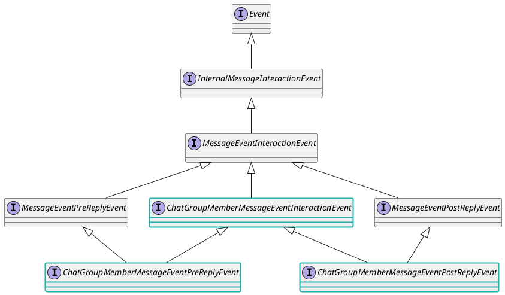
<deflist type="medium">
<def title="ChatGroupMemberMessageEventPreReplyEvent" id="ChatGroupMemberMessageEventPreReplyEvent">

针对 `ChatGroupMemberMessageEvent.reply` 的拦截事件。

</def>
<def title="ChatGroupMemberMessageEventPostReplyEvent" id="ChatGroupMemberMessageEventPostReplyEvent">

针对 `ChatGroupMemberMessageEvent.reply` 的通知事件。

</def>
</deflist>

</def>

</deflist>

## 完整类关系图

> 自动生成的。

```plantuml
@startuml

interface ActorEvent extends BotEvent, ContentEvent
interface ContactEvent extends ActorEvent
interface OrganizationEvent extends ActorEvent
interface ChatRoomEvent extends ActorEvent
interface ChatGroupEvent extends ChatRoomEvent, OrganizationEvent
interface GuildEvent extends OrganizationEvent
interface OrganizationSourceEvent extends BotEvent, SourceEvent
interface ChannelEvent extends ActorEvent, OrganizationSourceEvent
interface ChatChannelEvent extends ChannelEvent, ChatRoomEvent
interface MemberEvent extends ActorEvent, OrganizationSourceEvent
interface ChatGroupMemberEvent extends MemberEvent
interface GuildMemberEvent extends MemberEvent
interface BotStageEvent extends InternalNotificationEvent, BotEvent
interface BotRegisteredEvent extends BotStageEvent
interface BotStartedEvent extends BotStageEvent
interface Event
interface ComponentEvent extends Event
interface BotEvent extends ComponentEvent
interface ContentEvent extends Event
interface SourceEvent extends Event
interface ChangeEvent extends ContentEvent
interface InternalEvent extends Event
interface InternalNotificationEvent extends InternalEvent
interface InternalInterceptionEvent extends InternalEvent
interface InternalMessageInteractionEvent extends InternalEvent
interface InternalMessagePreSendEvent extends InternalInterceptionEvent, InternalMessageInteractionEvent
interface InternalMessagePostSendEvent extends InternalMessageInteractionEvent
interface MemberChangeEvent extends ChangeEvent, MemberEvent
interface GuildMemberChangeEvent extends ChangeEvent, GuildMemberEvent
interface GroupMemberChangeEvent extends ChangeEvent, ChatGroupMemberEvent
interface MessageContentAwareEvent extends Event
interface MessageEvent extends BotEvent, MessageContentAwareEvent
interface AuthorAwareMessageEvent extends MessageEvent
interface ActorAuthorAwareMessageEvent extends AuthorAwareMessageEvent
interface MemberAuthorAwareMessageEvent extends ActorAuthorAwareMessageEvent
interface ChatRoomMessageEvent extends MessageEvent, ChatRoomEvent
interface ChatGroupMessageEvent extends ChatRoomMessageEvent, ChatGroupEvent, MemberAuthorAwareMessageEvent
interface ChatChannelMessageEvent extends ChatRoomMessageEvent, ChatChannelEvent, MemberAuthorAwareMessageEvent
interface MemberMessageEvent extends MessageEvent, MemberEvent
interface ChatGroupMemberMessageEvent extends MessageEvent, MemberEvent
interface GuildMemberMessageEvent extends MessageEvent, MemberEvent
interface ContactMessageEvent extends MessageEvent, ContactEvent
interface OrganizationChangeEvent extends ChangeEvent, OrganizationEvent
interface MemberIncreaseOrDecreaseEvent extends OrganizationChangeEvent
interface MemberIncreaseEvent extends MemberIncreaseOrDecreaseEvent
interface MemberDecreaseEvent extends MemberIncreaseOrDecreaseEvent
interface ChatGroupMemberIncreaseOrDecreaseEvent extends MemberIncreaseOrDecreaseEvent, ChatGroupEvent
interface ChatGroupMemberIncreaseEvent extends MemberIncreaseEvent, ChatGroupMemberIncreaseOrDecreaseEvent
interface ChatGroupMemberDecreaseEvent extends MemberDecreaseEvent, ChatGroupMemberIncreaseOrDecreaseEvent
interface GuildMemberIncreaseOrDecreaseEvent extends MemberIncreaseOrDecreaseEvent, GuildEvent
interface GuildMemberIncreaseEvent extends MemberIncreaseEvent, GuildMemberIncreaseOrDecreaseEvent
interface GuildMemberDecreaseEvent extends MemberDecreaseEvent, GuildMemberIncreaseOrDecreaseEvent
interface ReplySupportInteractionEvent extends BotEvent, InternalMessageInteractionEvent
interface ReplySupportPreReplyEvent extends ReplySupportInteractionEvent, InternalMessagePreSendEvent
interface ReplySupportPostReplyEvent extends ReplySupportInteractionEvent, InternalMessagePostSendEvent
interface MessageEventInteractionEvent extends ReplySupportInteractionEvent
interface MessageEventPreReplyEvent extends MessageEventInteractionEvent, ReplySupportPreReplyEvent
interface MessageEventPostReplyEvent extends MessageEventInteractionEvent, ReplySupportPostReplyEvent
interface ContactMessageEventInteractionEvent extends MessageEventInteractionEvent
interface ContactMessageEventPreReplyEvent extends ContactMessageEventInteractionEvent, MessageEventPreReplyEvent
interface ContactMessageEventPostReplyEvent extends ContactMessageEventInteractionEvent, MessageEventPostReplyEvent
interface ChatRoomMessageEventInteractionEvent extends MessageEventInteractionEvent
interface ChatRoomMessageEventPreReplyEvent extends ChatRoomMessageEventInteractionEvent, MessageEventPreReplyEvent
interface ChatRoomMessageEventPostReplyEvent extends ChatRoomMessageEventInteractionEvent, MessageEventPostReplyEvent
interface ChatGroupMessageEventInteractionEvent extends ChatRoomMessageEventInteractionEvent
interface ChatGroupMessageEventPreReplyEvent extends ChatGroupMessageEventInteractionEvent, ChatRoomMessageEventPreReplyEvent
interface ChatGroupMessageEventPostReplyEvent extends ChatGroupMessageEventInteractionEvent, ChatRoomMessageEventPostReplyEvent
interface ChatChannelMessageEventInteractionEvent extends ChatRoomMessageEventInteractionEvent
interface ChatChannelMessageEventPreReplyEvent extends ChatChannelMessageEventInteractionEvent, ChatRoomMessageEventPreReplyEvent
interface ChatChannelMessageEventPostReplyEvent extends ChatChannelMessageEventInteractionEvent, ChatRoomMessageEventPostReplyEvent
interface MemberMessageEventInteractionEvent extends MessageEventInteractionEvent
interface MemberMessageEventPreReplyEvent extends MemberMessageEventInteractionEvent, MessageEventPreReplyEvent
interface MemberMessageEventPostReplyEvent extends MemberMessageEventInteractionEvent, MessageEventPostReplyEvent
interface GuildMemberMessageEventInteractionEvent extends MessageEventInteractionEvent
interface GuildMemberMessageEventPreReplyEvent extends GuildMemberMessageEventInteractionEvent, MessageEventPreReplyEvent
interface GuildMemberMessageEventPostReplyEvent extends GuildMemberMessageEventInteractionEvent, MessageEventPostReplyEvent
interface ChatGroupMemberMessageEventInteractionEvent extends MessageEventInteractionEvent
interface ChatGroupMemberMessageEventPreReplyEvent extends ChatGroupMemberMessageEventInteractionEvent, MessageEventPreReplyEvent
interface ChatGroupMemberMessageEventPostReplyEvent extends ChatGroupMemberMessageEventInteractionEvent, MessageEventPostReplyEvent
interface RequestEvent extends BotEvent
interface OrganizationRequestEvent extends RequestEvent, OrganizationEvent
interface OrganizationJoinRequestEvent extends OrganizationRequestEvent
interface ChatGroupJoinRequestEvent extends OrganizationJoinRequestEvent, ChatGroupEvent
interface GuildJoinRequestEvent extends OrganizationJoinRequestEvent, GuildEvent
interface SendSupportInteractionEvent extends BotEvent, InternalMessageInteractionEvent
interface SendSupportPreSendEvent extends SendSupportInteractionEvent, InternalMessagePreSendEvent
interface SendSupportPostSendEvent extends SendSupportInteractionEvent, InternalMessagePostSendEvent
interface ContactInteractionEvent extends SendSupportInteractionEvent
interface ContactPreSendEvent extends ContactInteractionEvent, SendSupportPreSendEvent
interface ContactPostSendEvent extends ContactInteractionEvent, SendSupportPostSendEvent
interface MemberInteractionEvent extends SendSupportInteractionEvent
interface MemberPreSendEvent extends MemberInteractionEvent, SendSupportPreSendEvent
interface MemberPostSendEvent extends MemberInteractionEvent, SendSupportPostSendEvent
interface ChatRoomInteractionEvent extends SendSupportInteractionEvent
interface ChatRoomPreSendEvent extends ChatRoomInteractionEvent, SendSupportPreSendEvent
interface ChatRoomPostSendEvent extends ChatRoomInteractionEvent, SendSupportPostSendEvent
interface ChatGroupInteractionEvent extends ChatRoomInteractionEvent
interface ChatGroupPreSendEvent extends ChatGroupInteractionEvent, ChatRoomPreSendEvent
interface ChatGroupPostSendEvent extends ChatGroupInteractionEvent, ChatRoomPostSendEvent
interface ChatChannelInteractionEvent extends ChatRoomInteractionEvent
interface ChatChannelPreSendEvent extends ChatChannelInteractionEvent, ChatRoomPreSendEvent
interface ChatChannelPostSendEvent extends ChatChannelInteractionEvent, ChatRoomPostSendEvent

@enduml
```

